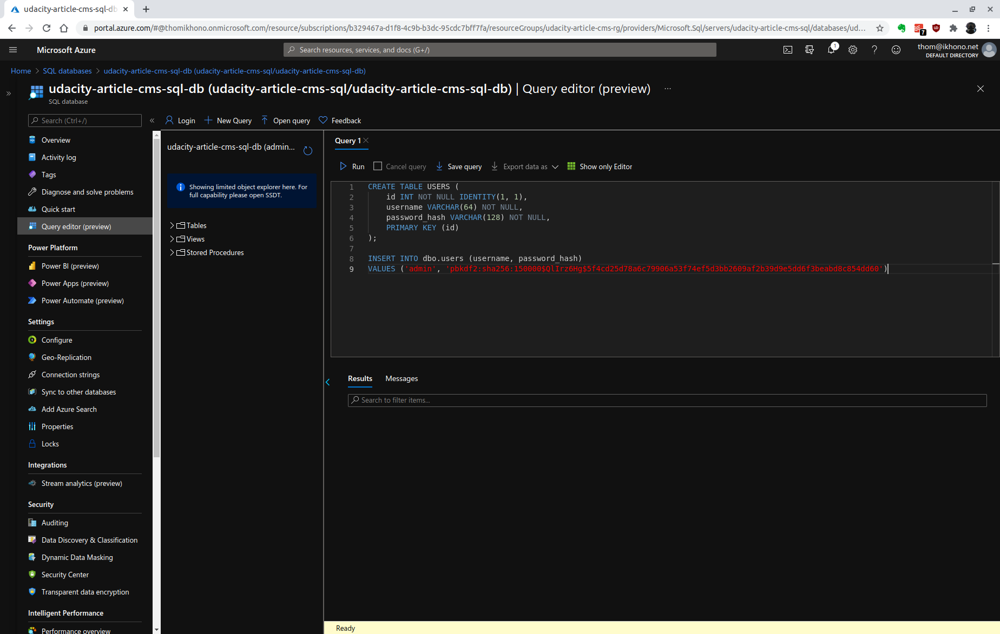
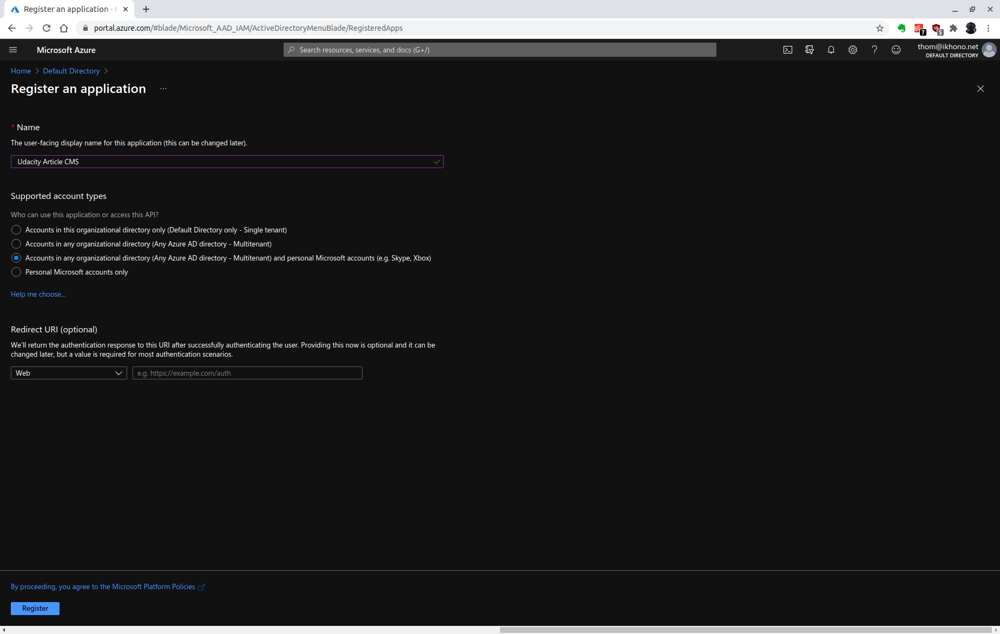
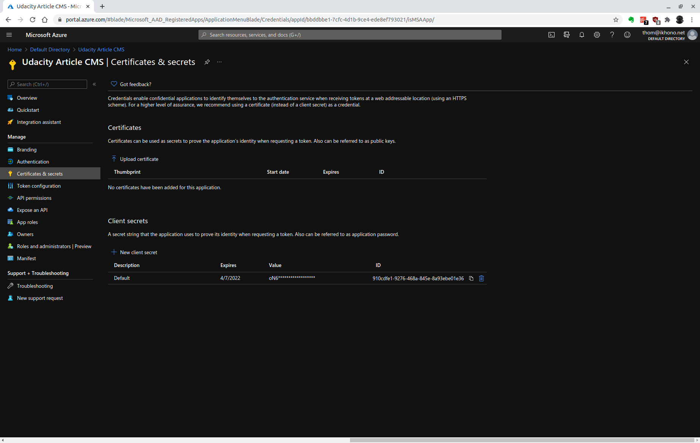
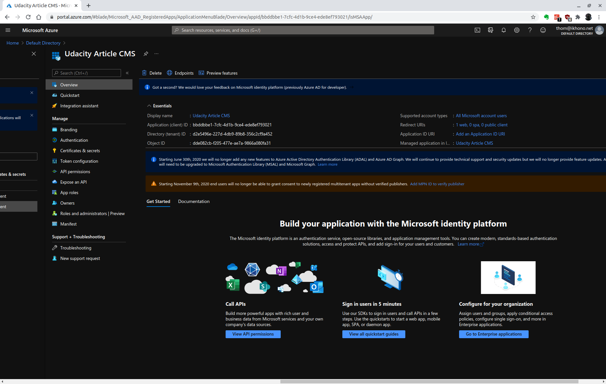
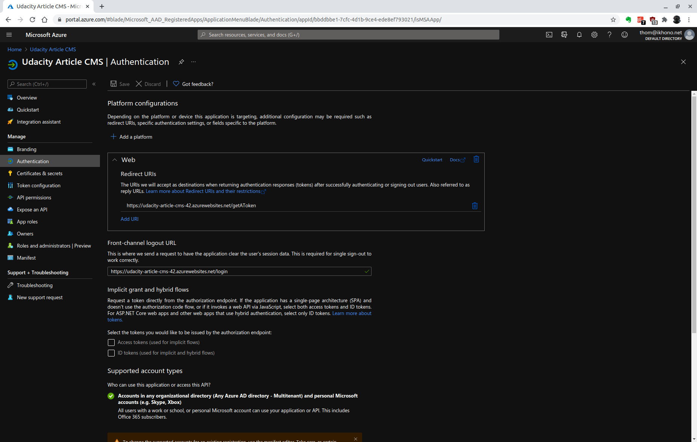

# Udacity Cloud Developer using Microsoft Azure Nanodegree Program - Project: Deploy an Article CMS to Azure

- [Introduction](#introduction)
- [Getting Started](#getting-started)
  - [Dependencies](#dependencies)
- [Instructions](#instructions)
  - [Login with Azure CLI](#login-with-azure-cli)
  - [Create a Resource Group in Azure](#create-a-resource-group-in-azure)
  - [Create an SQL database for CMS data](#create-an-sql-database-for-cms-data)
  - [Add data to the database](#add-data-to-the-database)
  - [Create a Storage Container for images](#create-a-storage-container-for-images)
  - [Setup OAuth2 with MSAL](#setup-oauth2-with-msal)
  - [Configure Flask application](#configure-flask-application)
  - [Run app locally](#run-app-locally)
  - [Deploy App Service Web App](#deploy-app-service-web-app)
- [Clean-up](#clean-up)
- [Screenshots](#screenshots)
- [References](#references)
- [Requirements](#requirements)
- [License](#license)

## Introduction

This project is a Python web application built using Flask. The user can log in and out and create/edit articles. An article consists of a title, author, and body of text stored in an Azure SQL Server along with an image that is stored in Azure Blob Storage. You will also implement OAuth2 with Sign in with Microsoft using the `msal` library, along with app logging.

## Getting Started

1. Clone this repository
2. Ensure you have all the dependencies
3. Follow the instructions below

### Dependencies

The following are the dependecies of the project you will need:

- Create an [Azure Account](https://portal.azure.com)
- Install the following tools:
  - [Python](https://www.python.org/downloads/)
  - [Azure command line interface](https://docs.microsoft.com/en-us/cli/azure/install-azure-cli?view=azure-cli-latest)
  - [Visual Studio Code](https://code.visualstudio.com/)

All Python dependencies are stored in the requirements.txt file.

## Instructions

### Login with Azure CLI

This project uses your Azure user and the Azure CLI to login and execute commands:

```bash
az login
```

Check [Create an Azure service principal with the Azure CLI](https://docs.microsoft.com/en-us/cli/azure/create-an-azure-service-principal-azure-cli?view=azure-cli-latest) if you prefer using a service principal instead.

### Create a Resource Group in Azure

Run the code below to create a new Resource Group:

```bash
az group create \
    --name udacity-article-cms-rg \
    --location eastus \
    --tags "dept=Engineering" \
    --tags "environment=Production" \
    --tags "project=Udacity Article CMS" \
    --tags "createdby=CLI"
```

### Create an SQL database for CMS data

To create an Azure SQL Database in the Azure Portal:

1. Find the "SQL databases" service in Azure
2. Click "Create SQL Database"
3. Select the appropriate subscription and `udacity-article-cms-rg` resource group
4. Enter a database name
5. Create a new SQL server, enter a server name, and then admin and password
   - Make sure you can remember these, or you will not be able to access the server when necessary
   - Set the location to match the resource group
6. Keep SQL elastic pool on the default of "No"
7. Under Compute+Storage, press "Looking for basic, standard, premium?", and change it to "Basic"
8. Press the "Next: Networking" button, then select "Public Endpoint", and set both of the Firewall rules that appear to "Yes"
9. Click "Review + Create" and then "Create" to create the database, then wait for it to deploy

Alternatively it also possible to use Azure CLI.

Create SQL server:

```bash
az sql server create \
    --admin-user adminuser \
    --admin-password p@ssword1234 \
    --name udacity-article-cms-sql \
    --resource-group udacity-article-cms-rg \
    --location eastus \
    --enable-public-network true \
    --verbose
```

Create firewall rule to allow Azure services and resources to access the server we just created:

```bash
az sql server firewall-rule create \
    -g udacity-article-cms-rg \
    -s udacity-article-cms-sql \
    -n azureaccess \
    --start-ip-address 0.0.0.0 \
    --end-ip-address 0.0.0.0 \
    --verbose
```

Set your computer's public IP address to the server's firewall (see [WhatsMyIP.com](https://www.whatismyip.com/)):

```bash
az sql server firewall-rule create \
    -g udacity-article-cms-rg \
    -s udacity-article-cms-sql \
    -n clientip \
    --start-ip-address <PUBLIC-IP-ADDRESS> \
    --end-ip-address <PUBLIC_IP_ADDRESS> \
    --verbose
```

Create SQL database:

```bash
az sql db create \
    --name udacity-article-cms-sql-db \
    --resource-group udacity-article-cms-rg \
    --server udacity-article-cms-sql \
    --tier Basic \
    --verbose
```

### Add data to the database

Open the query editor for your SQL database in the Azure portal:



Execute the content of the following two SQL scripts:

- [users-table-init.sql](./sql_scripts/users-table-init.sql)
- [posts-table-init.sql](./sql_scripts/posts-table-init.sql)

### Create a Storage Container for images

First we create our storage account. We use the following command:

```bash
az storage account create \
    --name udacityarticlecmsst \
    --resource-group udacity-article-cms-rg \
    --location eastus
```

Then we create our container:

```bash
az storage container create \
    --account-name udacityarticlecmsst \
    --name images \
    --auth-mode login \
    --public-access container
```

### Setup OAuth2 with MSAL

To register your app and get the necessary app information, follow the below steps:

1. Navigate to Azure Active Directory in the Azure portal.
   - If you are using a corporate Microsoft account, you might be restricted from access, in which case you would need to use a personal account for this stage of the exercise.
2. You should already have a default tenant to use, but if not, create a new tenant and fill in the required information.
3. Navigate to the "App registrations" page, and enter a name for the app, while allowing the widest set of accounts to access it.
Remember, you'll likely want to be more restrictive when creating your own apps.
4. You can ignore the Redirect URI for now, as that will be added later.



5. After you click "Register", copy down the "Application (client) ID", as you'll need that for the configuration.
6. Additionally, under "Manage", click "Certificates & secrets", then "+ New client secret", then enter a description. Copy down the string under "Value", and make sure you store it somewhere safe. You will need it for the configuration of `CLIENT_SECRET` (see [below](#configure-flask-application)).



### Configure Flask application

Open the `config.py` file and configure the following variables:

- `BLOB_ACCOUNT`: The name of your BLOB account, e.g. `udacityarticlecmsst`
- `BLOB_STORAGE_KEY`: Open the storage account in the Azure portal and copy the key from "Access keys"
- `BLOB_CONTAINER`: `images`
- `SQL_SERVER`: The URL of your SQL server, e.g. `udacity-article-cms-sql.database.windows.net`
- `SQL_DATABASE`: The name of your SQL database, e.g. `udacity-article-cms-sql-db`
- `SQL_USER_NAME`: The name of your SQL admin user, e.g. `adminuser`
- `SQL_PASSWORD`: The SQL admin user password
- `CLIENT_SECRET`: Copy the value stored when registering the application (see [above](#setup-oauth2-with-msal))
- `AUTHORITY`: `https://login.microsoftonline.com/common` for multi-tenant app, else put the tenant name instead of `common`
- `CLIENT_ID`: Copy the client ID from the application registration (see screenshot below)



### Run app locally

Create a virtual environment and activate it:

```bash
python3 -m venv ~/.azure-article-cms
source ~/.azure-article-cms/bin/activate
```

Run the Flask application:

```bash
FLASK_APP=application.py flask run
```

Now you can access the application on your [localhost on port 5000](http://127.0.0.1:5000) and login with the following credentials:

- Username: admin
- Password: pass

The "Sign in with Microsoft" button does not work yet (see [below](#deploy-app-service-web-app) on how to set it up).

### Deploy App Service Web App

In order to deploy the application to Azure App Service, you can run the following command:

```
az webapp up \
    --resource-group udacity-article-cms-rg \
    --name udacity-article-cms-42 \
    --sku F1 \
    --verbose
```

The name must be unique. If you visit the URL, you should see your site deployed.

If you want to update your app, make changes to your code and then run:

```
az webapp up \
    --name udacity-article-cms-42 \
    --verbose
```

In order to finish the "Sign in with Microsoft" setup, you have to configure the redirect URIs. To do this, open the application registration for your application, open "Authentication" and add a new URI for the web. Don't forget to configure the front-channel logout URL as well.



## Clean-up

The easiest way to clean-up all resources created in this project, is to delete the resource group:

```bash
az group delete -n udacity-article-cms-rg
```

## Screenshots

TBD

This folder contains sample screenshots that students are required to submit in order to prove they completed various tasks throughout the project.

1. article-cms-solution.png is a screenshot from running the FlaskWebProject on Azure and prove that the student was able to create a new entry. The Title, Author, and Body fields must be populated to prove that the data is being retrieved from the Azure SQL Database while the image on the right proves that an image was uploaded and pulled from Azure Blob Storage.
2. azure-portal-resource-group.png is a screenshot from the Azure Portal showing all of the contents of the Resource Group the student needs to create. The resource group must (at least) contain the following:
	- Storage Account
	- SQL Server
	- SQL Database
	- Resources related to deploying the app
3. sql-storage-solution.png is a screenshot showing the created tables and one query of data from the initial scripts.
4. blob-solution.png is a screenshot showing an example of blob endpoints for where images are sent for storage.
5. uri-redirects-solution.png is a screenshot of the redirect URIs related to Microsoft authentication.
6. log-solution.png is a screenshot showing one potential form of logging with an "Invalid login attempt" and "admin logged in successfully", taken from the app's Log stream. You can customize your log messages as you see fit for these situations.

## References

- [Azure Command-Line Interface (CLI) documentation](https://docs.microsoft.com/en-us/cli/azure/)
- [Connect an app to Azure Storage](https://docs.microsoft.com/en-us/learn/modules/connect-an-app-to-azure-storage/)
- [Store application data with Azure Blob storage](https://docs.microsoft.com/en-us/learn/modules/store-app-data-with-azure-blob-storage/)
- [Work with relational data in Azure](https://docs.microsoft.com/en-us/learn/paths/work-with-relational-data-in-azure/)
- [Provision an Azure SQL database to store application data](https://docs.microsoft.com/en-us/learn/modules/provision-azure-sql-db/)
- [MSAL Python documentation](https://msal-python.readthedocs.io/en/latest/)
- [Host a web application with Azure App Service](https://docs.microsoft.com/en-us/learn/modules/host-a-web-app-with-azure-app-service/)
- [Deploy a website to Azure with Azure App Service](https://docs.microsoft.com/en-us/learn/paths/deploy-a-website-with-azure-app-service/)

## Requirements

Graded according to the [Project Rubric](https://review.udacity.com/#!/rubrics/2850/view).

## License

- **[MIT license](http://opensource.org/licenses/mit-license.php)**
- Copyright 2021 © [Thomas Weibel](https://github.com/thom).
