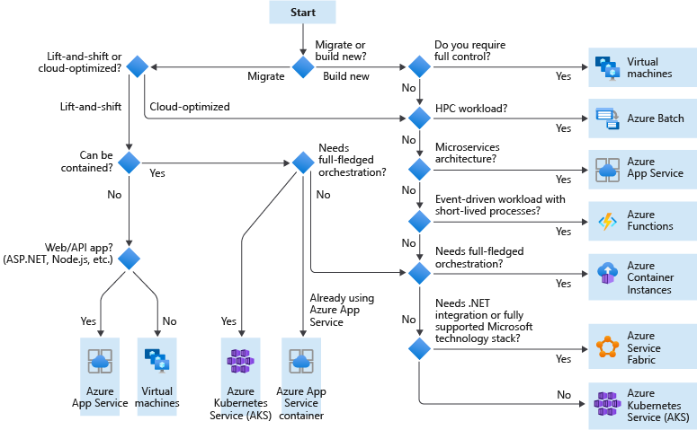

# Write-up Template

### Analyze, choose, and justify the appropriate resource option for deploying the app.

_For **both** a VM or App Service solution for the CMS app:_

- _Analyze costs, scalability, availability, and workflow_
- _Choose the appropriate solution (VM or App Service) for deploying the app_
- _Justify your choice_

In order to decide which compute option to use, I followed the following flowchart:

[Choose an Azure compute service for your application
](https://docs.microsoft.com/en-us/azure/architecture/guide/technology-choices/compute-decision-tree) gives a good summary on the different compute options available on Azure.

Based on the information provided by the overview, I chose App Service for this project.

### Assess app changes that would change your decision.

_Detail how the app and any other needs would have to change for you to change your decision in the last section._

App Service has some limitations:

- Scalability (14GB RAM and 4 vCPU cores per instance)
- Limited programming language support

In case the app needs better scalability or needs to support a different programming language, I would need to switch to VMs.